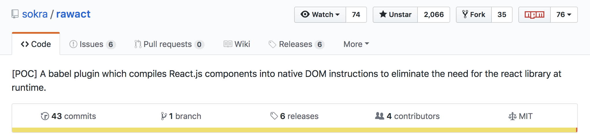

import { Appear } from "mdx-deck";
export { default as theme } from "./theme";

# Hello Folks 👋

---

# Farzad YZ

Software Engineer

- Javascript, GraphQL, React, State Managements, Node.js, Static Generators
- Open Source (🙏 Github)
- FP: Like Elm, Love Reason

Passionate about: Meetups, Conferences, Talks.

---

# Where to find me

- Twitter: [@Farzad_YZ](https://twitter.com/@farzad_yz)
- Medium : [@Farzad_YZ](https://medium.com/@farzad_yz)
- Github : [@farskid](https://github.com/farskid)
- Website: [farzadyz.com](https://farzadyz.com)

---

# React without React 🤨

---

# React(ish) thinking is Great

<ul>
  <Appear>
    <li>Revolution in FE</li>
    <li>Declarative API</li>
    <li>Component based UI</li>
    <li>Built-in State handling</li>
    <li>Sync/Async rendering</li>
    <li>Built-in code splitting</li>
    <li>Decoupled UI/business with Hooks</li>
    <li>Reusability by design systems</li>
    <li>Brings other goodies with itself 🍾</li>
  </Appear>
</ul>

---

# What is the problem then?

<ul>
  <Appear>
    <li>Adding up to Runtime job</li>
    <li>Scripting time ==> Slower bootstrap time</li>
    <li>Asset size: 95.8 (RD) + 5.9 (R) = 101.7</li>
    <li>Not using the platform</li>
    <li>Shipping native platform bindings, not the framework!</li>
  </Appear>
</ul>

---

# The idea

- Ship UX and not the DX (React)
- Save great DX stuff such as React for development
- Compile native bindings to do the required job
- Native bindings: Native mobile, DOM, Web Components, WASM, ...

---

# Pioneers

- SvelteJS, The magical disappearing UI framework by <em>Rich Harris</em>
- StencilJS, The magical, reusable web component compiler by <em>Ionic Team</em>

---

# What about React then?

rawact (babel-plugin-rawact) by Tobias Koppers

---

# When does it make sense?

<ul>
  <Appear>
    <li>Small apps, less components == decrease in total bundle size</li>
    <li>
      Code splitted apps == without react,react-dom initial bootstrap is faster
    </li>
    <li>👆 Gatsby and Next.js apps 👆</li>
    <li>Compile React Components to WC == no need to ship React</li>
    <li>
      Apps with lots of component instances ==> native bindings are faster and
      has less overhread
    </li>
    <li>
      Apps with focus on low-end devices ==> native bindings are faster and has
      less overhread
    </li>
  </Appear>
</ul>

---

# Notes

- It's still a proof of concept.
- Supports all React features besides Suspense and Inceremental rendering.
- Alternatives might be choosing Elm or Reason.
- A last resort might also be Preact and hyperApp.

---

# Demo time

👉 only bundle size for now

- Note that it's still POC

---

# Thanks for being patient ❤️

[Rawact](https://github.com/sokra/rawact)
[Demo 1](https://github.com/sokra/todo-mvc-react-hooks-experiments)
[Demo 2](https://github.com/sokra/rawact/app)

Slides Available at:

[https://headless-react.netlify.com](https://headless-react.netlify.com)
